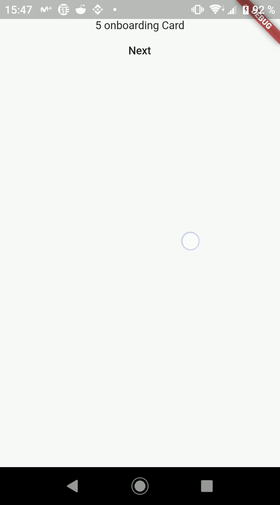

# Horizontal Blocked ScrollPhysics

[](https://travis-ci.com/alpha-health/horizontal_blocked_scroll_physics) [](https://opensource.org/licenses/MIT) [](https://pub.dartlang.org/packages/horizontal_blocked_scroll_physics)

A [ScrollPhysics](https://api.flutter.dev/flutter/widgets/ScrollPhysics-class.html) class that blocks movement in the horizontal axis.

## How to use it

The API of this `ScrollPhysics` is fairly straighforward.

Basically, you have a couple of properties in order to block right (`blockRightMovement`) and left (`blockLeftMovement`) movements.

### Blocking movement

```dart
HorizontalBlockedScrollPhysics(blockLeftMovement: true);
```

You can see here that the user is `swiping` to the left (which is blocked) but the screen will be able to move to the left if the movement is not completed. Note that the text will go back to the center.


